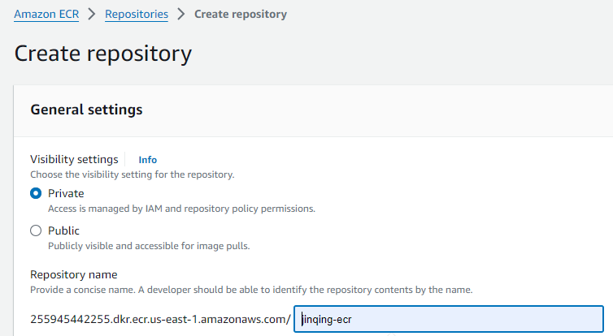

# Step-by-step how to create an image till deployed to AWS ECR

## Background
In this assignment, we will be re-using hello-node application in assignment 3.4 then push the docker image to private ECR named **jinqing-ecr**.

## Creating ECR (private repository)
At the AWS console, on the search bar (at the top), type ECR or Elastic Container Registry and click on it. After which you will be redirected to Amazon ECR with a list of repositories. Click on the `Create repository` (orange button), and it will bring you to the following page (as per below screenshot):



In this example, We shall create this repository as private and named it as **jinqing-ecr** (but it can be any name), then click on `Create repository` at the bottom of the page to create it.

## Creating Docker Image
Next we are going to containerise the hello-node application.
\
\
To do so, first run the command "docker build -t <IMAGE_NAME> .".
\
\
But since the name of the ECR is **jinqing-ecr**, our image name will be **jinqing-ecr**.
\
\
For instance:
``````````````````````````````
docker build -t jinqing-ecr .
``````````````````````````````
**Important:** Do not forget the period at the end! It means to build an image using the files from the current folder.
\
\
To see if the image is saved in docker, run the following command:
``````````````
docker images
``````````````
## Pushing image to ECR
To push the image into AWS ECR using AWS CLI, run the following command:
``````````````````````````````````````````````````````````````````````````````````````````````````````````````````````````````````````````
aws ecr get-login-password --region us-east-1 | docker login --username AWS --password-stdin 255945442255.dkr.ecr.us-east-1.amazonaws.com
``````````````````````````````````````````````````````````````````````````````````````````````````````````````````````````````````````````
This will retrieve an authentication token and authenticate your Docker client to your registry. If successful, you will see "Login Succeeded".
\
\
Next, tag your image so you can push the image to this repository:
``````````````````````````````````````````````````````````````````````````````````````````````
docker tag jinqing-ecr:latest 255945442255.dkr.ecr.us-east-1.amazonaws.com/jinqing-ecr:latest
``````````````````````````````````````````````````````````````````````````````````````````````
Once done, you are ready to push the image to the ECR!
````````````````````````````````````````````````````````````````````````````
docker push 255945442255.dkr.ecr.us-east-1.amazonaws.com/jinqing-ecr:latest
````````````````````````````````````````````````````````````````````````````


